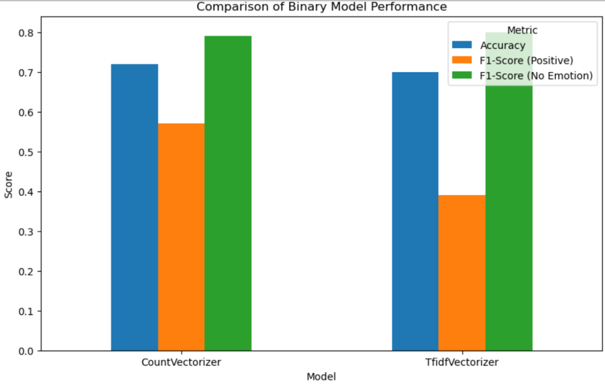
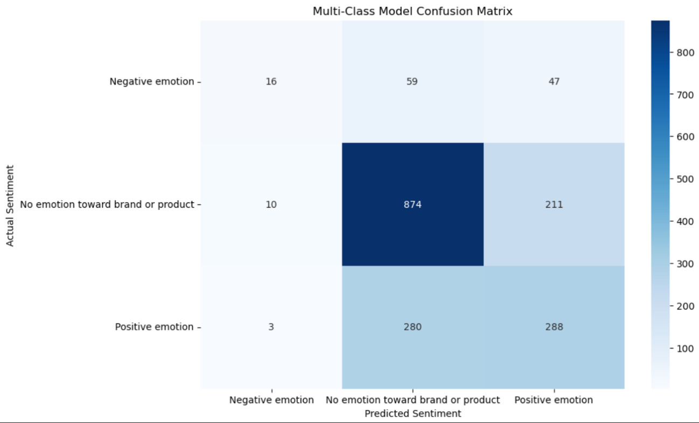

# NLP Tweet Sentiment Analysis

## Project Overview

This project focuses on building and evaluating machine learning models
to classify the sentiment of tweets directed at brands and products. We
explored both a binary classification approach (positive vs. negative)
and a multi-class classification approach (negative, neutral, or
positive emotion).

The project followed an agile methodology, with work broken down into
several key sprints:

### Sprint 1: Data Exploration, Cleaning, and Preprocessing

**Goal:** To prepare the raw tweet data for modeling.\
**Deliverable:** A cleaned dataset (`cleaned_tweets.csv`) ready for
feature engineering.

### Sprint 2: Development and Evaluation of the Binary Sentiment Model

**Goal:** To build an initial model that can distinguish between
positive and negative sentiment.\
**Deliverable:** A trained binary classification model and its
performance report.

### Sprint 3: Development and Evaluation of the Multi-Class Sentiment Model

**Goal:** To expand the model's capabilities to classify multiple
sentiments (positive, negative, and no emotion).\
**Deliverable:** A trained multi-class classification model and its
performance report.

### Sprint 4: Final Model Serialization, Evaluation, and Documentation

**Goal:** To finalize the project by selecting the best model, saving it
for future use, and creating comprehensive documentation.\
**Deliverable:** The final sentiment model, a project conclusion, and a
detailed README.

------------------------------------------------------------------------

## Methodology

### 1. Data Cleaning & Preprocessing

The raw dataset, `judge_tweet_product_company.csv`, was preprocessed to
prepare the text data for modeling. The cleaning process included: -
Lowercasing all text. - Removing URLs, user mentions (@), and special
characters. - Applying lemmatization to reduce words to their base or
root form.

### 2. Feature Engineering

We used two different vectorization techniques to convert the cleaned
text data into a numerical format that machine learning models can
understand: - **CountVectorizer:** Creates a document-term matrix where
each cell represents the raw count of a word in a document. -
**TfidfVectorizer:** Calculates the term frequency-inverse document
frequency, a more sophisticated method that weighs words based on their
importance to a document and the entire corpus.

### 3. Modeling

The core of our modeling approach was a **Logistic Regression
classifier**. We used this model for both the binary and multi-class
classification tasks.

To optimize model performance, we conducted extensive **hyperparameter
tuning** using `GridSearchCV`. This process systematically searched for
the best combination of parameters to maximize the model's F1-score.

### 4. Model Evaluation & Interpretability

We evaluated the model's performance on unseen test data using key
metrics such as: - **Accuracy:** Overall percentage of correct
predictions. - **Precision, Recall, and F1-Score:** Metrics to evaluate
performance on a per-class basis. - **Confusion Matrix:** A visual
representation of correct and incorrect predictions for each class.

Finally, we performed **model interpretability** by analyzing the
model's coefficients. This allowed us to understand which words most
heavily influenced the model's sentiment predictions.

------------------------------------------------------------------------

## Visuals

### Model Performance Comparison


This chart compares the performance of our binary models, highlighting
their strengths in key metrics.

### Confusion Matrix

The confusion matrix for our multi-class model shows a detailed
breakdown of correct and incorrect predictions, providing insight into
which classes the model is most likely to confuse.

### Top Words by Sentiment


This visual will show the most influential words for each sentiment
class, providing a human-readable explanation of our model's logic.

------------------------------------------------------------------------

## Project Deliverables

-   A Jupyter Notebook (`nlp_final.ipynb`) containing all the code for
    data processing, modeling, evaluation, and interpretability.
-   A comprehensive project conclusion and recommendation
    (`conclusion.md`).
-   A GitHub repository to manage the project's source code and
    documentation.

------------------------------------------------------------------------

## How to Run the Project

1.  Clone this repository.\

2.  Navigate to the project directory.\

3.  Install the required dependencies using pip:

    ``` bash
    pip install -r requirements.txt
    ```

4.  Open the `nlp_final.ipynb` notebook and run the cells in order.
